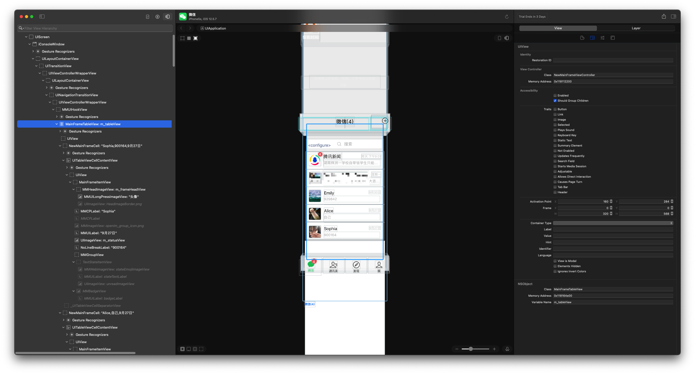
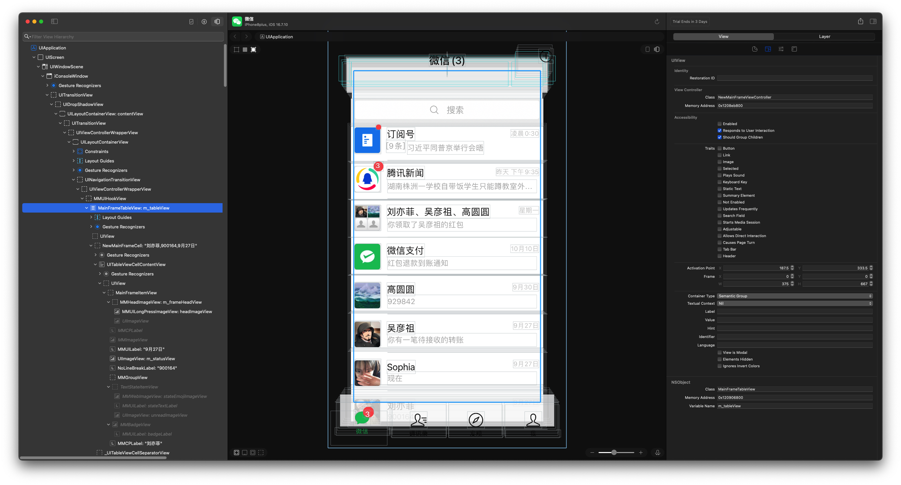

# RevealLoader2

[RevealLoader](https://github.com/heardrwt/RevealLoader) 的升级版，增加了对 rootless 越狱设备的支持。
An upgraded version of [RevealLoader](https://github.com/heardrwt/RevealLoader) that adds support for rootless jailbreak devices.

理论上支持的版本是 iOS 7.0 - iOS 17.5。作者已在以下设备成功运行：
Theoretically supported versions are iOS 7.0 - iOS 17.5. The author has successfully tested it on:

* **Rootful**: iOS 12.5.7
* **Rootless**: iOS 16.7.10

> **Note:** 对于越狱开发，可以尝试使用 [LookinLoader2](https://github.com/masterKing/LookinLoader2) 查看 UI，它支持命令调试且已开源。
> **Note:** For jailbreak development, it is currently more recommended to use [LookinLoader2](https://github.com/masterKing/LookinLoader2) for UI inspection; it supports command debugging and is open-source.

---

## RevealServer.framework

2026年01月07日将插件默认的 RevealServer.framework 版本更新到 Version 50。如果版本不符合你电脑上的 Reveal 版本，可以自行替换：
On January 7, 2026, the default RevealServer.framework was updated to Version 50. If this doesn't match the Reveal version on your Mac, you can replace it manually:

1. **Rootful**: 将 Mac 上的 `RevealServer.framework` 安装到 `/Library/Frameworks`。
   **Rootful**: Install `RevealServer.framework` from your Mac to `/Library/Frameworks`.
2. **Rootless**: 将 Mac 上的 `RevealServer.framework` 安装到 `/var/jb/Library/Frameworks`。
   **Rootless**: Install `RevealServer.framework` from your Mac to `/var/jb/Library/Frameworks`.

---

## 截图 | Screenshots

**iOS 12.5.7:**

**iOS 16.7.10:**

---

## 如何使用 | How to Use

可以使用两种方式安装：
You can install it in two ways:

1. **软件源安装 | Via Repo**: 
   添加源 [https://masterking.github.io/sileorepo/](https://masterking.github.io/sileorepo/) 进行安装。
   Add the repository [https://masterking.github.io/sileorepo/](https://masterking.github.io/sileorepo/) and install.

2. **编译安装 | Via Source**: 
   下载源码自行编译安装。
   Download the source code and compile it yourself.